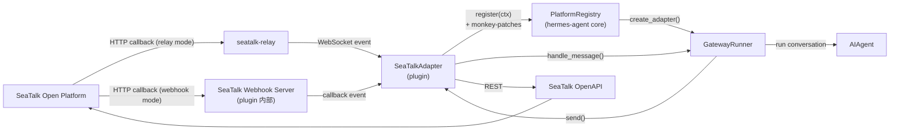

# Hermes SeaTalk Platform Plugin：技术设计

## 0. 背景与本文档定位

[hermes-seatalk(deprecated)](../../../hermes-seatalk\(deprecated\)/docs/spec/td_hermes-seatalk_zh.md)
已完整定义了 SeaTalk 接入的功能范围、协议约束和 API 设计。本文档**不重复**这些内容，
而是聚焦于从 **in-tree fork** 切换到 **外部 platform plugin** 的架构差异与实现路径。

### 方案选型

- **deprecated 方案**：直接在 hermes-agent 仓库中修改 16 个核心文件，维护成本高。
- **本方案**：所有 SeaTalk 逻辑封装在 [arxeme/hermes-seatalk](https://github.com/arxeme/hermes-seatalk)
  独立仓库中。通过 `PlatformRegistry.register(PlatformEntry(...))` 注册，
  四处本应修改 hermes-agent 核心的改动改由 `register()` 内 monkey-patch 完成，
  **不向 hermes-agent 提交任何 upstream PR，不修改任何 hermes-agent 源文件**。

功能范围、验收标准、SeaTalk 协议细节、安全约束、数据模型与 deprecated TD 完全对齐，
本文档只描述变化的部分。

---

## 1. 架构对比

### 1.1 集成方式变化

| 维度 | Deprecated (in-tree) | 本方案 (plugin) |
|---|---|---|
| 仓库 | hermes-agent fork | https://github.com/arxeme/hermes-seatalk |
| 分发 | 修改 hermes-agent 代码 | `git clone` + `hermes plugins enable` |
| 注册机制 | `Platform` enum + if/elif chain | `PlatformRegistry.register(PlatformEntry(...))` |
| 授权集成 | 修改 `run.py` 授权 map | `PlatformEntry.allowed_users_env / allow_all_env` |
| send_message 路由 | 修改 `send_message_tool.py` | monkey-patch target parser + send_to_platform + home channel |
| cron delivery | 修改 `_KNOWN_DELIVERY_PLATFORMS` | monkey-patch scheduler 白名单 |
| prompt hint | 修改 `prompt_builder.py` | `PlatformEntry.platform_hint` |
| 最大消息长度 | 修改 send_message_tool | `PlatformEntry.max_message_length` |
| setup wizard | 修改 `hermes_cli/gateway.py` | `PlatformEntry.setup_fn` |
| home channel | 修改 `config.py` from_env_and_file | monkey-patch `GatewayConfig.get_home_channel` |
| hermes-agent 改动 | **16 处核心文件** | **0 处**（全部在 plugin 内完成） |
| 上游升级 | 需手动 backport | plugin 版本独立，与 hermes-agent 解耦 |

### 1.2 整体架构



---

## 2. 仓库结构

仓库 [arxeme/hermes-seatalk](https://github.com/arxeme/hermes-seatalk)
的根目录**即 plugin 目录**，`git clone` 到 `~/.hermes/plugins/seatalk/` 后
通过 `hermes plugins enable seatalk-platform` 启用：

```
hermes-seatalk/          ← git repo root = plugin root (~/.hermes/plugins/seatalk/)
├── plugin.yaml          # Plugin manifest（hermes-agent 加载入口）
├── pyproject.toml       # Python package metadata / local test config
├── __init__.py          # root package shim，导出 register
├── adapter.py           # root entry shim，供 Hermes loader import adapter.register
├── hermes_seatalk/      # 实际 Python package
│   ├── __init__.py
│   ├── adapter.py       # SeaTalkAdapter + register(ctx) + monkey-patches
│   ├── client.py        # SeaTalk OpenAPI client + token 管理
│   ├── relay.py         # WebSocket relay client
│   ├── webhook.py       # aiohttp webhook HTTP server
│   ├── dispatcher.py    # Event dedup + debounce + dispatch
│   ├── targets.py       # SeaTalk target parse/format
│   └── coalescer.py     # Outbound coalescer（per-chat buffer）
├── requirements.txt     # 兼容直接安装依赖（aiohttp>=3.9）
├── docs/
│   └── spec/
│       └── td_hermes-seatalk-plugin_zh.md   ← 本文档
└── README.md
```

除 root `adapter.py` / `__init__.py` 作为 Hermes plugin loader 兼容入口外，
业务源码统一放在 `hermes_seatalk/` 包内。root `adapter.py` 只做 re-export，
不承载运行时逻辑，避免 repo 名 `hermes-seatalk` 不能作为 Python package 名导致的
import 混乱。

`requirements.txt` 内容：

```
aiohttp>=3.9
```

`aiohttp` 是 hermes-agent 自身依赖（Teams、Matrix 等 adapter 已使用），
正常安装环境下已满足，无需单独安装。`requirements.txt` 用于独立开发/测试时的环境复现。

### 2.1 plugin.yaml

```yaml
name: seatalk-platform
kind: platform
version: 1.0.0
description: >
  SeaTalk messaging platform adapter for Hermes Agent.
  Supports DM and group/thread messages via webhook or relay gateway.
  Connects to SeaTalk Open Platform using a Bot App (appId + appSecret + signingSecret).
author: AI Agent Team
requires_env:
  - SEATALK_APP_ID
  - SEATALK_APP_SECRET
  - SEATALK_SIGNING_SECRET
  - SEATALK_MODE
```

---

## 3. register() 与 monkey-patch

root `adapter.py` 的 `register(ctx)` 是 hermes-agent plugin loader 调用的唯一入口；
实际实现位于 `hermes_seatalk/adapter.py`。
除注册 `PlatformEntry` 外，它完成四处 monkey-patch，使 cron delivery、
send_message target 解析、thread/media 路由和 home channel 解析无需 upstream 改动即可支持 SeaTalk。

```python
def register(ctx):
    """Plugin entry point called by hermes-agent plugin loader."""
    _patch_cron_scheduler()
    _patch_send_message_tool()
    _patch_send_to_platform()
    _patch_home_channel()
    _register_platform()
```

### 3.1 Patch 1：cron scheduler 白名单

```python
def _patch_cron_scheduler():
    """Add 'seatalk' to cron delivery whitelist and home-target env map."""
    try:
        import cron.scheduler as _sched

        # _KNOWN_DELIVERY_PLATFORMS is a frozenset; replace the module attribute.
        if "seatalk" not in _sched._KNOWN_DELIVERY_PLATFORMS:
            _sched._KNOWN_DELIVERY_PLATFORMS = frozenset(
                _sched._KNOWN_DELIVERY_PLATFORMS | {"seatalk"}
            )

        # _HOME_TARGET_ENV_VARS is a plain dict; mutate in-place.
        if "seatalk" not in _sched._HOME_TARGET_ENV_VARS:
            _sched._HOME_TARGET_ENV_VARS["seatalk"] = "SEATALK_HOME_CHANNEL"

    except ImportError:
        pass  # cron module not present in this hermes build
```

**可行性**：`_KNOWN_DELIVERY_PLATFORMS` 和 `_HOME_TARGET_ENV_VARS` 均以 `LOAD_GLOBAL`
在运行时查找；`if "seatalk" not in` 保证幂等，多次 `register()` 不重复添加。

### 3.2 Patch 2：send_message target parser

```python
def _patch_send_message_tool():
    """Inject SeaTalk target parsing into send_message_tool._parse_target_ref."""
    try:
        import tools.send_message_tool as _smt
        import re

        # Idempotency guard — prevents double-wrapping on repeated register() calls.
        if getattr(_smt._parse_target_ref, "_seatalk_patched", False):
            return

        _original_parse = _smt._parse_target_ref

        def _patched_parse(platform_name: str, target_ref: str):
            if platform_name == "seatalk":
                # group/<group_id>:<thread_id>
                m = re.fullmatch(r"(group/[^:]+):(.+)", target_ref)
                if m:
                    return m.group(1), m.group(2), True
                # group/<group_id>
                if target_ref.startswith("group/"):
                    return target_ref, None, True
                # <email>:<thread_id>
                m = re.fullmatch(r"([^@:]+@[^@:]+\.[^@:]+):(.+)", target_ref)
                if m:
                    return m.group(1), m.group(2), True
                # <employee_code>:<thread_id>
                m = re.fullmatch(r"([A-Za-z0-9_\-]+):(.+)", target_ref)
                if m:
                    return m.group(1), m.group(2), True
                # <employee_code> or <email>
                if target_ref and not target_ref.startswith(":"):
                    return target_ref, None, True
                return None, None, False
            return _original_parse(platform_name, target_ref)

        _patched_parse._seatalk_patched = True
        _smt._parse_target_ref = _patched_parse

    except ImportError:
        pass
```

> **注意**：employee_code / group_id / thread_id 保持原始大小写；email 在 send 前由
> adapter 内部 lower-case，不在 parser 层处理。

### 3.3 Patch 3：send_to_platform SeaTalk 专用路径

**问题背景**：`_send_to_platform` 的通用 plugin fallback（`else` 分支）调用
`_send_via_adapter(platform, pconfig, chat_id, chunk)`，不传 `thread_id`，
也不处理 `media_files`。直接后果：

- `send_message(target="seatalk:group/123:thread456")` 的 thread_id 被静默丢弃，
  消息发到 group 主频道。
- `send_message` 携带 media 时图片/文件静默丢弃。

> **不受影响**：gateway 的 inbound→reply 路径由 cron scheduler 直接调用
> `runtime_adapter.send(chat_id, text, metadata={"thread_id": thread_id})`，
> thread_id 在该路径正确传递。

**修复**：注入 SeaTalk 专用路径，在进入通用 `else` 之前拦截。

```python
def _patch_send_to_platform():
    """Inject SeaTalk-aware send path that forwards thread_id and media."""
    try:
        import tools.send_message_tool as _smt

        # Idempotency guard.
        if getattr(_smt._send_to_platform, "_seatalk_patched", False):
            return

        _orig = _smt._send_to_platform

        async def _patched(platform, pconfig, chat_id, message,
                           thread_id=None, media_files=None):
            if getattr(platform, "value", str(platform)) == "seatalk":
                return await _seatalk_send_to_platform(
                    platform, chat_id, message,
                    thread_id=thread_id,
                    media_files=media_files or [],
                )
            return await _orig(platform, pconfig, chat_id, message,
                               thread_id=thread_id, media_files=media_files)

        _patched._seatalk_patched = True
        _smt._send_to_platform = _patched

    except ImportError:
        pass


async def _seatalk_send_to_platform(platform, chat_id, message,
                                     thread_id=None, media_files=None):
    """SeaTalk-specific send path: chunks text, forwards thread_id and media."""
    from gateway.run import _gateway_runner_ref
    from gateway.platforms.base import BasePlatformAdapter

    runner = _gateway_runner_ref()
    if not runner:
        return {"error": "No gateway runner. Is the gateway running?"}
    adapter = runner.adapters.get(platform)
    if not adapter:
        return {"error": "No live SeaTalk adapter. Is the gateway running with SeaTalk connected?"}

    metadata = {"thread_id": thread_id} if thread_id else None
    results = []

    # Send text (chunked to SEATALK_TEXT_CHUNK_LIMIT / max_message_length).
    if message:
        from gateway.platform_registry import platform_registry
        entry = platform_registry.get("seatalk")
        max_len = entry.max_message_length if entry else 4000
        chunks = BasePlatformAdapter.truncate_message(message, max_len)
        for chunk in chunks:
            result = await adapter.send(chat_id=chat_id, content=chunk, metadata=metadata)
            if not result.success:
                return {"error": f"SeaTalk send failed: {result.error}"}
            results.append(result)

    # Send media files.
    for media_path, _is_voice in (media_files or []):  # SeaTalk has no native voice format; route by ext
        import os
        ext = os.path.splitext(media_path)[1].lower()
        _IMAGE_EXTS = {".jpg", ".jpeg", ".png", ".webp", ".gif"}
        if ext in _IMAGE_EXTS:
            result = await adapter.send_image_file(
                chat_id, media_path, caption="", metadata=metadata
            )
        else:
            result = await adapter.send_document(
                chat_id, media_path, caption="", metadata=metadata
            )
        if not result.success:
            return {"error": f"SeaTalk media send failed: {result.error}"}

    return {"success": True, "message_id": results[-1].message_id if results else None}
```

### 3.4 Patch 4：home channel 解析

**问题背景**：`send_message(target="seatalk")` 无目标时，`send_message_tool` 调用
`config.get_home_channel(Platform("seatalk"))` 读取 `PlatformConfig.home_channel`。
但 plugin enable pass（`config.py`）只创建空白 `PlatformConfig()` 并设 `enabled=True`，
不会将 `SEATALK_HOME_CHANNEL` env 写入 `home_channel` 字段，导致始终返回 None。

cron 的 `_HOME_TARGET_ENV_VARS` patch（Patch 1）只覆盖 cron 路径，不影响 `send_message`。

**修复**：monkey-patch `GatewayConfig.get_home_channel`，当标准查找返回 None 时对 SeaTalk
回退读取 `SEATALK_HOME_CHANNEL` env var，行为与 `send_message_tool` 内 Weixin 硬编码 fallback 一致。

```python
def _patch_home_channel():
    """Patch GatewayConfig.get_home_channel to read SEATALK_HOME_CHANNEL from env."""
    try:
        from gateway.config import GatewayConfig, HomeChannel

        # Idempotency guard.
        if getattr(GatewayConfig.get_home_channel, "_seatalk_patched", False):
            return

        _orig = GatewayConfig.get_home_channel

        def _patched(self, platform):
            result = _orig(self, platform)
            if result is not None:
                return result
            if getattr(platform, "value", str(platform)) == "seatalk":
                import os
                home = os.getenv("SEATALK_HOME_CHANNEL", "").strip()
                if home:
                    return HomeChannel(
                        platform=platform,
                        chat_id=home,
                        name=os.getenv("SEATALK_HOME_CHANNEL_NAME", "SeaTalk Home"),
                        thread_id=os.getenv("SEATALK_HOME_CHANNEL_THREAD_ID") or None,
                    )
            return None

        _patched._seatalk_patched = True
        GatewayConfig.get_home_channel = _patched

    except Exception:
        pass
```

### 3.5 Platform 注册

```python
def _register_platform():
    from gateway.platform_registry import platform_registry, PlatformEntry
    platform_registry.register(PlatformEntry(
        name="seatalk",
        label="SeaTalk",
        emoji="💬",
        adapter_factory=lambda cfg: SeaTalkAdapter(cfg),
        check_fn=check_seatalk_requirements,
        validate_config=_validate_seatalk_config,
        is_connected=_is_seatalk_connected,
        setup_fn=_seatalk_setup_wizard,
        required_env=[
            "SEATALK_APP_ID",
            "SEATALK_APP_SECRET",
            "SEATALK_SIGNING_SECRET",
            "SEATALK_MODE",
        ],
        allowed_users_env="SEATALK_ALLOWED_USERS",
        allow_all_env="SEATALK_ALLOW_ALL_USERS",
        max_message_length=4000,
        platform_hint=_SEATALK_PLATFORM_HINT,
        plugin_name="seatalk-platform",
        source="plugin",
    ))
```

**三个 callable 字段的行为**（对齐 IRC plugin 模式）：

| 函数 | 检查内容 | 返回 | 用途 |
|---|---|---|---|
| `check_seatalk_requirements()` | `SEATALK_APP_ID/APP_SECRET/SIGNING_SECRET/MODE` 均已设置 + `SEATALK_MODE` 必须为 `relay` 或 `webhook` + relay mode 时 `SEATALK_RELAY_URL` 存在 + `import aiohttp` 可成功 | `bool` | plugin enable pass（config.py）：返回 True 才会创建 `PlatformConfig` 并启用平台；`status.py` 也直接用 `check_fn()` 显示"configured" |
| `_validate_seatalk_config(cfg)` | mode 必须为 `relay` 或 `webhook`；relay mode：credentials + `relay_url` 均非空；webhook mode：credentials 非空 + port 合法 | `bool` | `is_connected` 的底层实现 |
| `_is_seatalk_connected(cfg)` | 与 `_validate_seatalk_config` 相同：credentials 完整即视为 connected | `bool` | `GatewayConfig._is_platform_connected()` → `get_connected_platforms()`（adapter 启动判断） |

> **为什么 `is_connected` 不查 live adapter**：gateway 调用 `get_connected_platforms()` 在启动时决定要创建哪些 adapter，此时 adapter 尚未存在；查 live 状态会造成鸡生蛋问题，导致 SeaTalk adapter 永远不会被创建。IRC plugin 同样将 `is_connected` 定义为 credentials 存在检查。

```python
def check_seatalk_requirements() -> bool:
    import os
    try:
        import aiohttp  # noqa: F401
    except ImportError:
        return False
    if not all(os.getenv(v) for v in (
        "SEATALK_APP_ID", "SEATALK_APP_SECRET",
        "SEATALK_SIGNING_SECRET", "SEATALK_MODE",
    )):
        return False
    mode = os.getenv("SEATALK_MODE", "").lower()
    if mode not in {"relay", "webhook"}:
        return False
    # Mode-specific required env — relay needs RELAY_URL to be usable.
    if mode == "relay":
        return bool(os.getenv("SEATALK_RELAY_URL"))
    return True  # webhook mode has no additional required env


def _validate_seatalk_config(cfg) -> bool:
    import os
    extra = getattr(cfg, "extra", {}) or {}
    mode = (os.getenv("SEATALK_MODE") or extra.get("mode", "")).lower()
    if mode not in {"relay", "webhook"}:
        return False
    if not all(os.getenv(v) or extra.get(k) for v, k in (
        ("SEATALK_APP_ID", "app_id"),
        ("SEATALK_APP_SECRET", "app_secret"),
        ("SEATALK_SIGNING_SECRET", "signing_secret"),
    )):
        return False
    if mode == "relay":
        return bool(os.getenv("SEATALK_RELAY_URL") or extra.get("relay_url"))
    port = os.getenv("SEATALK_WEBHOOK_PORT") or extra.get("webhook_port") or 8646
    try:
        return 1 <= int(port) <= 65535
    except (TypeError, ValueError):
        return False


def _is_seatalk_connected(cfg) -> bool:
    return _validate_seatalk_config(cfg)
```

`Platform("seatalk")` 通过 `Platform._missing_()` 动态创建 enum 成员，
无需预先在 `gateway/config.py` 中声明。

### 3.6 交互式 setup wizard

`_seatalk_setup_wizard()` 由 `PlatformEntry.setup_fn` 暴露给 Hermes。
用户安装的 plugin 必须先完成 `git clone` 和
`hermes plugins enable seatalk-platform`，之后才会出现在
`hermes setup` / `hermes gateway setup` 的 messaging platform TUI 中。

setup wizard 不负责安装或启用 plugin，只负责写入 SeaTalk runtime 配置。
交互顺序：

1. 读取现有 env/config 作为默认值。
2. 询问通用 credentials：`SEATALK_APP_ID`、`SEATALK_APP_SECRET`、
   `SEATALK_SIGNING_SECRET`。
3. 询问 `SEATALK_MODE`，只能选择 `relay` 或 `webhook`。
4. 若选择 `relay`，只要求输入 `SEATALK_RELAY_URL`，不要求
   `SEATALK_WEBHOOK_HOST/PORT/PATH`。
5. 若选择 `webhook`，只询问 webhook host/port/path，均有默认值；
   不要求 `SEATALK_RELAY_URL`。wizard 需要提示用户把 SeaTalk Bot App 的
   callback URL 指向该路径，并说明 TLS 可由外部反代终止。
6. 询问可选项：home channel/thread、用户 allowlist、group allowlist、
   group mention 策略。
7. 写入 `~/.hermes/.env` 或 Hermes 约定的 gateway 配置位置，并提示重启
   hermes gateway 后生效。

模式互斥规则：

- `relay` 与 `webhook` 是二选一运行模式。
- wizard、`check_seatalk_requirements()` 和 `_validate_seatalk_config()`
  只要求当前 mode 对应的字段。
- 切换 mode 时，旧 mode 的环境变量可以保留，但必须被当前 mode 的校验忽略；
  文档和状态展示不得把未使用 mode 的字段显示为必填缺失。

---

## 4. 组件设计

### 4.1 SeaTalkAdapter（adapter.py）

继承 `BasePlatformAdapter`，`send()` 的参数名与基类一致（`content`，不是 `text`）。

```python
class SeaTalkAdapter(BasePlatformAdapter):
    def __init__(self, config):
        platform = Platform("seatalk")
        super().__init__(config=config, platform=platform)
        self.app_id         = os.getenv("SEATALK_APP_ID")         or config.extra.get("app_id", "")
        self.app_secret     = os.getenv("SEATALK_APP_SECRET")     or config.extra.get("app_secret", "")
        self.signing_secret = os.getenv("SEATALK_SIGNING_SECRET") or config.extra.get("signing_secret", "")
        self.mode           = (os.getenv("SEATALK_MODE") or config.extra.get("mode", "relay")).lower()
        # ... 其余配置见 §5
```

必须实现的方法（参数名与 `BasePlatformAdapter` 一致）：

| 方法 | 行为 |
|---|---|
| `connect() -> bool` | 根据 `mode` 启动 webhook server 或连接 relay |
| `disconnect()` | 关闭 WebSocket / HTTP server / HTTP client / tasks |
| `send(chat_id, content, metadata=None) -> SendResult` | 发送文本；`metadata["thread_id"]` 透传给 SeaTalk API；`content` 由调用方保证为纯文本（gateway 在调用前已提取 MEDIA 标记） |
| `send_typing(chat_id)` | SeaTalk typing API |
| `send_image(chat_id, image_url, caption, metadata=None) -> SendResult` | 远程 URL → base64 → native image |
| `send_image_file(chat_id, image_path, caption, metadata=None) -> SendResult` | 本地文件 → base64 → native image |
| `send_document(chat_id, file_path, caption, file_name=None, metadata=None) -> SendResult` | 本地文件 → base64 → native file |
| `get_chat_info(chat_id) -> dict` | 返回 `{name, type, chat_id}` |

> **MEDIA 标记约定**：hermes-agent gateway 在调用 `adapter.send()` 之前通过
> `BasePlatformAdapter.extract_media()` 提取 `MEDIA:<path>` 标记，因此 `send()` 收到的
> `content` 为纯文本。媒体文件经由 `send_image_file()` / `send_document()` 单独发送。

chat_id 格式：

| 目标类型 | chat_id | thread_id |
|---|---|---|
| DM | `<employee_code>` | SeaTalk thread_id 或 None |
| Group | `group/<group_id>` | SeaTalk thread_id 或 None |

### 4.2 SeaTalk OpenAPI Client（client.py）

与 deprecated TD §3.4 完全一致（参考 `openclaw-seatalk/src/client.ts`）：

- base URL 硬编码 `https://openapi.seatalk.io`
- token 在过期前 600s 刷新，刷新去重（`asyncio.Event`）
- `code=100` → 刷新 token 后重试一次；`code=101` → 固定 backoff 重试（10s、60s，最多 2 次）
- 日志记录 `x-rid`，不记录 token/secret

**Email 解析失败处理**：`get_employee_code_by_email()` 找不到 active employee 时，
`send()` 返回：

```python
SendResult(success=False, error=(
    "SeaTalk: no active employee found for email '<email>'. "
    "Check the email is correct and the account is active in your SeaTalk organization."
))
```

调用方（send_message_tool / cron scheduler）将该 error 返回给 agent，由 agent 展示给用户。
负向缓存 10min，防止错误 email 频繁打 API。

关键方法：

```python
async def send_single_chat(self, employee_code: str, message: dict, thread_id: str | None = None) -> dict
async def send_group_chat(self, group_id: str, message: dict, thread_id: str | None = None) -> dict
async def send_single_chat_typing(self, employee_code: str, thread_id: str | None = None) -> None
async def send_group_chat_typing(self, group_id: str, thread_id: str | None = None) -> None
async def get_employee_code_by_email(self, emails: list[str]) -> dict[str, str | None]
  # email -> employee_code；未找到时 value 为 None（负向缓存）
async def get_message_by_id(self, message_id: str) -> dict
async def get_dm_thread(self, employee_code: str, thread_id: str, **kwargs) -> dict
async def get_group_thread(self, group_id: str, thread_id: str, **kwargs) -> dict
async def get_group_info(self, group_id: str) -> dict
```

### 4.3 Webhook Server（webhook.py）

与 deprecated TD §3.2 / §6.1 完全一致，基于 `aiohttp.web`：

- `POST <SEATALK_WEBHOOK_PATH>`（默认 `/callback`）
- 请求体最大 1 MB
- `Signature` header 校验：`sha256(raw_body + signing_secret_latin1).hexdigest()`，constant-time compare
- `event_type=event_verification` → 返回 `{"seatalk_challenge": "..."}`
- 普通事件 → 验签通过后立即返回 200，后台 task 异步 dispatch
- 端口冲突立即报错，不静默重试

### 4.4 Relay Client（relay.py）

与 deprecated TD §3.3 / §6.2 完全一致，复用 `seatalk-relay` 现有协议：

```
WebSocket connect
  → auth{type,appId,appSecret,signingSecret}
  → auth_ok (connected, reset backoff)
  / auth_fail (fatal, stop reconnect)
  → event (dispatch)
  → ping (reply pong)
  → replaced (non-fatal, reconnect with backoff)
  → network disconnect (exponential backoff + jitter reconnect)
```

| Relay 事件 | 状态 | 行为 |
|---|---|---|
| `auth_ok` | connected | reset backoff |
| `auth_fail` | **fatal** | 停止重连，设 fatal error |
| `event` | connected | 进入 dispatcher |
| `ping` | connected | 发送 `pong` |
| `replaced` | disconnected | non-fatal 重连 |
| 网络断开 | disconnected | 指数退避 + jitter 重连 |

### 4.5 Event Dispatcher（dispatcher.py）

与 deprecated TD §3.5 完全对齐：

- **dedup**：`app_id:event_id`，TTL 30min，max 1000
- **debounce**：`app_id+employee_code+thread_id`（DM）/ `app_id+group_id+employee_code+thread_id`（group），slide 1.5s，hard cap 5s
- **self-message drop**：`sender.sender_type == 2` 直接 drop
- **group channel pre-filter**：若设置了 `SEATALK_GROUP_ALLOWED_USERS`，group 消息的 `chat_id`（`group/<group_id>`）须在列表中，否则 drop + warn（不记录 sender 信息）。用户级别授权由 gateway 完成，此处仅做 group channel 过滤。
- **text extraction**：优先 `message.text.plain_text`，fallback `message.text.content`
- **quoted message**：`quoted_message_id` 非空时调用 `get_message_by_id` 解析，拼到正文前；失败降级为原消息正文

支持的事件类型：

| `event_type` | 处理 |
|---|---|
| `message_from_bot_subscriber` | DM 文本 |
| `new_mentioned_message_received_from_group_chat` | Group @bot 文本 |
| `new_message_received_from_thread` | Thread 文本 |
| `new_bot_subscriber` / `bot_added_to_group_chat` / `bot_removed_from_group_chat` | 仅记录日志 |

`MessageEvent.source` 字段映射：

| 字段 | DM | Group/Thread |
|---|---|---|
| `platform` | `Platform("seatalk")` | `Platform("seatalk")` |
| `chat_type` | `dm` | `group` |
| `chat_id` | `<employee_code>` | `group/<group_id>` |
| `thread_id` | `message.thread_id` 或 None | `message.thread_id` 或 None |
| `user_id` | email（lower）；无 email 时用 employee_code | sender email；无时用 employee_code |
| `user_id_alt` | `employee_code` | sender `employee_code` |

### 4.6 Outbound Coalescer（coalescer.py）

与 deprecated TD §3.7.x / openclaw `outbound-coalescer.ts` 对齐：

- key：`(chat_id, thread_id)` 元组
- 默认开启（`SEATALK_OUTBOUND_COALESCING=true`），设 `false` 退化为逐段发送
- 仅作用于文本；media 不进入 coalescer
- adapter shutdown 时 flush 所有 buffer

### 4.7 授权

通过 `PlatformEntry.allowed_users_env="SEATALK_ALLOWED_USERS"` 和
`allow_all_env="SEATALK_ALLOW_ALL_USERS"` 声明，gateway 的 `_is_user_authorized` 自动读取。

**gateway 授权机制**：`_is_user_authorized` 以 `source.user_id` 和 email-prefix 匹配
`SEATALK_ALLOWED_USERS`。`source.user_id` 由 dispatcher 设置为 email（小写）；
若 SeaTalk 未返回 email，则 fallback 为 employee_code。因此：

- `SEATALK_ALLOWED_USERS` 填写 **email** 是可靠的（email 几乎总会返回）
- 填写 **employee_code** 仅在用户无 email 时才生效（fallback 路径）
- 建议统一使用 email 格式

**group channel 过滤**（`SEATALK_GROUP_ALLOWED_USERS`）在 `dispatcher.py` 内处理：
若设置此 env var，group 消息的 `chat_id`（`group/<group_id>`）须在列表中，否则 drop。
这是 channel 准入控制，不替代用户级 allowlist——sender 仍须通过 gateway 的用户授权。

---

## 5. 配置

| 环境变量 | 必填 | 说明 |
|---|---|---|
| `SEATALK_APP_ID` | 是 | Bot App ID |
| `SEATALK_APP_SECRET` | 是 | Bot App Secret |
| `SEATALK_SIGNING_SECRET` | 是 | Event Callback Signing Secret |
| `SEATALK_MODE` | 是 | `webhook` 或 `relay` |
| `SEATALK_RELAY_URL` | relay 模式是 | WebSocket URL，如 `wss://relay.example.com/ws` |
| `SEATALK_WEBHOOK_HOST` | webhook 模式否 | 默认 `0.0.0.0` |
| `SEATALK_WEBHOOK_PORT` | webhook 模式否 | 默认 `8646` |
| `SEATALK_WEBHOOK_PATH` | webhook 模式否 | 默认 `/callback` |
| `SEATALK_HOME_CHANNEL` | 否 | cron/send_message 默认投递目标（chat_id） |
| `SEATALK_HOME_CHANNEL_NAME` | 否 | 默认投递目标显示名 |
| `SEATALK_HOME_CHANNEL_THREAD_ID` | 否 | 默认投递目标的 thread_id（group thread 场景） |
| `SEATALK_ALLOWED_USERS` | 否 | 授权 allowlist（email 或 employee_code，逗号分隔） |
| `SEATALK_ALLOW_ALL_USERS` | 否 | 设为 `true` 允许所有用户 |
| `SEATALK_GROUP_ALLOWED_USERS` | 否 | 允许的 group target，如 `group/123,group/456` |
| `SEATALK_REQUIRE_MENTION` | 否 | group 场景要求 @bot，默认 `true` |
| `SEATALK_MEDIA_ALLOW_HOSTS` | 否 | 入站媒体允许 host，默认 `openapi.seatalk.io` |
| `SEATALK_TEXT_CHUNK_LIMIT` | 否 | 出站文本分片长度，默认 4000 |
| `SEATALK_OUTBOUND_COALESCING` | 否 | 出站合并开关，默认 `true` |

配置互斥原则：

- `SEATALK_MODE=relay` 时，`SEATALK_RELAY_URL` 是唯一额外必填项。
- `SEATALK_MODE=webhook` 时，不要求 `SEATALK_RELAY_URL`；
  `SEATALK_WEBHOOK_HOST/PORT/PATH` 使用默认值即可启动。
- 两种模式共享 credentials、home channel、allowlist、group 过滤等通用配置。
- 若环境中残留另一种模式的字段，当前模式的校验和启动逻辑必须忽略它。

---

## 6. 安装与分发

Plugin 从 [arxeme/hermes-seatalk](https://github.com/arxeme/hermes-seatalk) 获取。

### 6.1 安装步骤

```bash
# 1. 克隆到 hermes plugin 目录
git clone https://github.com/arxeme/hermes-seatalk.git ~/.hermes/plugins/seatalk

# 2. 启用 plugin（用户安装的 plugin 不自动加载，需要显式启用）
hermes plugins enable seatalk-platform

# 3. 配置 credentials（~/.hermes/.env 或系统环境变量）
cat >> ~/.hermes/.env << 'EOF'
SEATALK_APP_ID=your_app_id
SEATALK_APP_SECRET=your_app_secret
SEATALK_SIGNING_SECRET=your_signing_secret
SEATALK_MODE=relay
SEATALK_RELAY_URL=wss://relay.example.com/ws
EOF

# 4. 重启 hermes gateway
hermes gateway run
```

> **为什么需要 `hermes plugins enable`**：hermes-agent 的 plugin loader 对用户安装的
> plugin（`~/.hermes/plugins/`）要求显式 opt-in，以防止任意第三方 plugin 在用户不知情的
> 情况下运行。`kind: platform` 只对 hermes-agent 自带的 bundled plugin 才自动加载。

### 6.2 更新

```bash
cd ~/.hermes/plugins/seatalk && git pull
# 重启 hermes gateway
```

### 6.3 版本要求

- hermes-seatalk 在 `README.md` 中声明最低 hermes-agent 版本
- `aiohttp>=3.9`（hermes-agent 自身依赖，通常已满足；独立开发时 `pip install -r requirements.txt`）

### 6.4 安装验证

```bash
hermes gateway status
# 期望输出中包含：
# ✓ SeaTalk  [relay] connected  app_id: ...xxxx
```

---

## 7. send_message 与 cron 投递

### 7.1 send_message 目标格式

| 目标 | `send_message` target 参数 |
|---|---|
| DM by employee code | `seatalk:<employee_code>` |
| DM by email | `seatalk:<email>` |
| DM thread | `seatalk:<employee_code>:<thread_id>` |
| Group | `seatalk:group/<group_id>` |
| Group thread | `seatalk:group/<group_id>:<thread_id>` |

Plugin 路由：SeaTalk 由 Patch 3 的 `_seatalk_send_to_platform` 处理，
正确转发 `thread_id`（via `metadata`）和 `media_files`（via `send_image_file`/`send_document`）。

Email 形式 → `get_employee_code_by_email()` 解析，失败返回可读错误。

### 7.2 cron 投递

`deliver="seatalk"` 使用 `SEATALK_HOME_CHANNEL`；
`deliver="seatalk:<target>"` 覆盖投递目标。

cron scheduler 通过 `runtime_adapter.send(chat_id, text, metadata={"thread_id": thread_id})`
调用，thread_id 正确传递，行为与内置 platform 一致。

---

## 8. 数据模型

与 deprecated TD §5 完全一致，无新增 DB 表，内存缓存：

| 数据 | 存放 | 容量/TTL |
|---|---|---|
| token | adapter 内存 | 过期前 600s 刷新 |
| event dedup | 内存 LRU+TTL | max 1000，TTL 30min |
| email→employee_code | 内存 | 正向 24h，负向 10min |
| group name | 内存 | 无 TTL（仅 display 用） |
| inbound media | `~/.hermes/cache/{images,videos,documents}/` | hermes 既有 cache |

---

## 9. 安全

与 deprecated TD §7 完全一致：

- credentials 只通过 env 注入，不提交仓库
- 日志 mask secret/token；可记录 `app_id` 后 4 位
- webhook 基于 raw body 校验 `Signature`，constant-time compare
- 请求体限 1 MB
- webhook 明文 HTTP，TLS 由外部反代终端
- 默认 deny，group 场景默认只处理 @bot 事件

---

## 10. 可观测性

日志事件与 deprecated TD §9.1 完全一致。

`hermes gateway status` 展示两层信息：

1. **配置检查（静态）**：`_platform_status()` 优先调用 `entry.is_connected(synthetic_cfg)`
   （即 `_validate_seatalk_config`），fallback 到 `entry.check_fn()`，输出
   "configured" / "not configured"。

2. **运行时状态（动态）**：读取 gateway 持久化的 health state 文件
   （`_runtime_health_lines()` via `gateway.status.read_runtime_status()`）。
   SeaTalk adapter 须在 `connect()` / `disconnect()` 时向该文件写入运行状态
   （mode、connected / disconnected、relay URL、last error），运行时详情才会出现在
   status 输出中。具体字段格式对齐其他 adapter（如 IRC）的写入规范。

> 注：home channel 和 mode 等配置详情不由 `is_connected()` 返回；
> 若需要在 status 中展示这些信息，须由 adapter 写入 health state 文件。

---

## 11. 测试计划入口

测试覆盖继承 deprecated TD §10，补充 plugin 特有测试：

| 测试类型 | 覆盖 |
|---|---|
| Unit | `register(ctx)` 成功注册 PlatformEntry，所有字段正确 |
| Unit | `_patch_cron_scheduler()` 幂等：二次调用不重复添加 |
| Unit | `_patch_send_message_tool()` 幂等：二次 `register()` 不双重包装 |
| Unit | `_patch_send_to_platform()` 幂等：二次 `register()` 不双重包装 |
| Unit | `_patch_home_channel()` 幂等：二次 `register()` 不双重包装 |
| Unit | `_patch_home_channel()`：`SEATALK_HOME_CHANNEL` 设置时 `get_home_channel` 返回正确 `HomeChannel`；未设置时返回 None |
| Unit | `check_seatalk_requirements()`：credentials 缺失时返回 False；aiohttp 不可导入时返回 False；`SEATALK_MODE` 非 `relay/webhook` 时返回 False；relay mode 时 `SEATALK_RELAY_URL` 缺失返回 False；全部满足时返回 True |
| Unit | `_parse_target_ref("seatalk", ...)` 覆盖全部 target 格式；含 `email:thread_id` 格式正确拆分；不改写 employee_code/group_id/thread_id 大小写 |
| Unit | `_seatalk_send_to_platform` 正确转发 `thread_id` via `metadata` |
| Unit | `_seatalk_send_to_platform` 图片路由到 `send_image_file`，非图片路由到 `send_document` |
| Unit | email 解析失败返回可读 `SendResult.error` 而非 exception |
| Unit | `webhook.py`：`event_type=event_verification` 且签名有效时返回 `seatalk_challenge` |
| Unit | `dispatcher.py` group channel pre-filter：`SEATALK_GROUP_ALLOWED_USERS` 设置时 unlisted group 消息被 drop |
| Unit | `validate_config`：relay / webhook 模式 credentials 完整性校验 |
| Unit | `_patch_home_channel()`：`SEATALK_HOME_CHANNEL_THREAD_ID` 设置时 `HomeChannel.thread_id` 正确填充 |
| Integration | `hermes plugins enable` + hermes gateway 启动 + SeaTalkAdapter connect |
| Integration | mock relay + adapter connect + inbound `MessageEvent` |
| Integration | mock webhook callback + inbound `MessageEvent` |
| Integration | mock SeaTalk OpenAPI + `send()` DM / group |
| Integration | `SEATALK_HOME_CHANNEL` 设置时 `send_message(target="seatalk")` 正确路由到 home channel |
| Integration | mock OpenAPI + `send_message(target="seatalk:group/123:thread456")` → thread_id 正确到达 API |
| Integration | mock OpenAPI + `send_message` with `MEDIA:<image>` → `send_image_file` 被调用 |
| E2E | 真实 SeaTalk Bot App + shared relay + hermes gateway |
| E2E | 真实 SeaTalk Bot App + public webhook URL + hermes gateway |

---

## 12. 实施任务清单

1. 仓库初始化（`plugin.yaml`、root `adapter.py` / `__init__.py` shim、`requirements.txt`、`README.md`）
2. `hermes_seatalk/client.py`：token + `send_single_chat` + `send_group_chat` + email lookup
3. `hermes_seatalk/relay.py`：connect → auth → event → ping/pong → reconnect 状态机
4. `hermes_seatalk/dispatcher.py`：dedup + debounce + DM/group event → `MessageEvent`
5. `hermes_seatalk/adapter.py`：`connect(relay/webhook)` + `send(content)` + `send_typing` + `register(ctx)` + 四个 monkey-patch
6. `hermes_seatalk/webhook.py`：signature verify + event_verification + async dispatch
7. 入站媒体下载 + cache（deprecated TD §3.6 规则）
8. `send_image` / `send_image_file` / `send_document` → native base64 payload
9. `hermes_seatalk/coalescer.py`：per-chat buffer
10. `setup_fn`、`is_connected` callback、status 展示
11. 单元测试补全
12. `.env.example`

---

## 13. 开放问题

所有开放问题已关闭：

| 编号 | 问题 | 决策 |
|---|---|---|
| Q-1 | hermes-agent 改动方式 | **monkey-patch in `register()`**，不提交 upstream PR |
| Q-2 | email 解析失败处理 | **返回可读错误** `SendResult(success=False, error="...")` |
| Q-3 | Plugin 分发 | **[github.com/arxeme/hermes-seatalk](https://github.com/arxeme/hermes-seatalk)**，`git clone` + `hermes plugins enable` |

---

## 附录 A：与 deprecated TD 对照表

| deprecated TD 章节 | 本文档处理方式 |
|---|---|
| §1 概述 / 需求 / 验收标准 | 完全继承，不重复 |
| §2.1 架构概览 | §1.2 更新（新增 PlatformRegistry + monkey-patches） |
| §2.4 配置结构 | §5 完全继承，env 变量不变 |
| §3.1 SeaTalkAdapter | §4.1 更新（plugin 注册，`content` 参数名，MEDIA 标记约定） |
| §3.2 Webhook HTTP server | §4.3 完全继承 |
| §3.3 Relay WebSocket client | §4.4 完全继承 |
| §3.4 SeaTalk OpenAPI client | §4.2 继承并补充 email 失败返回错误 |
| §3.5 Event dispatcher | §4.5 完全继承 |
| §3.6 授权与 group 策略 | §4.7 更新（PlatformEntry 字段，无 run.py 改动） |
| §3.7 出站发送 + coalescing | §4.1 + §4.6 完全继承 |
| §3.8 Hermes 固定入口改动（16处） | §3 缩减为 4 处 monkey-patch（0 upstream PR） |
| §4 API 设计 | 完全继承 |
| §5 数据模型 | §8 完全继承 |
| §6 外部系统集成 | §4.3 / §4.4 完全继承 |
| §7 安全 | §9 完全继承 |
| §9 可观测性 | §10 完全继承 |
| §10 测试计划 | §11 继承并扩展 plugin / monkey-patch / thread / media 测试 |

## 附录 B：关键参考代码路径

| 文件 | 用途 |
|---|---|
| [platform_registry.py](../../../../hermes-agent/gateway/platform_registry.py) | `PlatformEntry` 定义，plugin 注册接口 |
| [base.py](../../../../hermes-agent/gateway/platforms/base.py) | `BasePlatformAdapter`（`send(content=)` 签名），`MessageEvent`, `SendResult` |
| [plugins/platforms/irc/adapter.py](../../../../hermes-agent/plugins/platforms/irc/adapter.py) | 参考 plugin 结构，`register()` 入口 |
| [hermes_cli/plugins.py](../../../../hermes-agent/hermes_cli/plugins.py) | Plugin 加载逻辑：user plugin 需 `hermes plugins enable` |
| [cron/scheduler.py](../../../../hermes-agent/cron/scheduler.py) | `_KNOWN_DELIVERY_PLATFORMS`（frozenset），`_HOME_TARGET_ENV_VARS`（dict） |
| [tools/send_message_tool.py](../../../../hermes-agent/tools/send_message_tool.py) | `_parse_target_ref()`，`_send_to_platform()`，`_send_via_adapter()` |
| [openclaw-seatalk/src/client.ts](../../../openclaw-seatalk/src/client.ts) | SeaTalk API client 参考 |
| [openclaw-seatalk/src/monitor.ts](../../../openclaw-seatalk/src/monitor.ts) | webhook server 参考 |
| [openclaw-seatalk/src/relay-client.ts](../../../openclaw-seatalk/src/relay-client.ts) | relay client 参考 |
| [openclaw-seatalk/src/bot.ts](../../../openclaw-seatalk/src/bot.ts) | event dispatch，dedup，debounce 参考 |
| [openclaw-seatalk/src/outbound-coalescer.ts](../../../openclaw-seatalk/src/outbound-coalescer.ts) | 出站 coalescer 参考 |
| [openclaw-seatalk/src/inbound-resolve.ts](../../../openclaw-seatalk/src/inbound-resolve.ts) | 入站媒体/quoted/forwarded 解析参考 |
| [seatalk-relay/index.ts](../../../seatalk-relay/index.ts) | relay 协议、认证、buffer、heartbeat |
